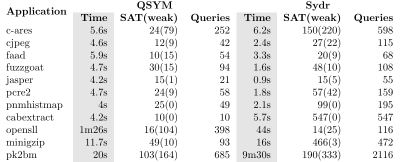

# QSYM and Sydr comparison

weak = optimistic solutions

Sydr was launched single-threaded because QSYM does not support multi-threaded
solving.

NOTE: QSYM generates multiple models for symbolic addresses. Thus, output
directory contains lots of inputs describing the same path. This feature was
disabled during comparison.
